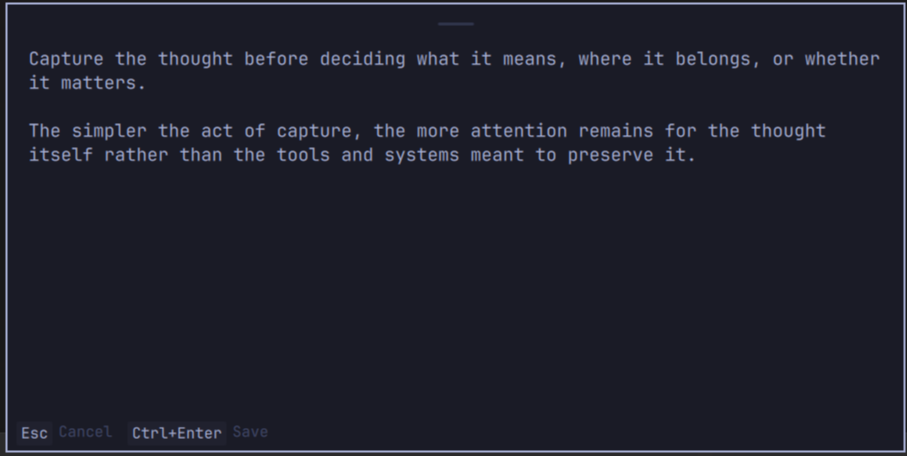

# Quick Capture

> Capture a thought or link without opening your notes app.

Quick Capture is a system-wide Markdown capture panel for Omarchy. Press a shortcut anywhere, write a thought or paste a link, save it, and immediately return to what you were doing.

It is inspired by Org-mode capture, but it does not require Emacs—or any particular notes application.



## Why Quick Capture?

Omarchy's scratchpad is instant but not note-aware. Full editors such as Omawrite, Obsidian, or Neovim understand notes but require opening an application. Quick Capture occupies the useful middle ground: instant, Markdown-aware, and editor-independent.

Quick Capture does not replace your notes application. It removes the friction of opening one every time you want to capture a thought.

## Features

- Native Omarchy `panel` plugin hosted by the existing `omarchy-shell`
- Focused multiline editor on the currently active monitor
- Always-on-top, mouse-draggable card that stays on its current monitor
- Click-through space outside the card, so text can be selected and copied from underlying applications
- `Ctrl+Enter` to save and close; `Esc` to cancel
- Configurable Markdown destination: supports both **single-file append** and **atomic multi-file directory (e.g. Obsidian Vault)** modes
- Smart link & domain detection: captures from YouTube, Shorts, Instagram, Reels, TikTok, Wikipedia, GitHub, or any website are automatically named cleanly without saving raw URL strings
- Automatic collision handling for notes with duplicate titles
- Configurable timestamp, tags, template, size, and position
- Theme-aware colors, typography, spacing, and corner radius
- Serialized writes with confirmation before the editor is cleared
- Clear retryable errors that preserve typed content
- Completely local; no telemetry, network services, or note uploads

## Installation

Quick Capture targets **Omarchy 4.0.0+ / manifest schema 1**.

### 1. Install the plugin

```bash
omarchy plugin add https://github.com/matt-aaz/omarchy-quick-capture.git --enable
```

### 2. Add the global shortcut

Check your current bindings before assigning `Super + N`:

```bash
omarchy menu keybindings --print
```

Plain `Super + N` is free in the stock Omarchy 4.0.0 bindings. If it is already assigned on your system, choose another shortcut. Otherwise, add this to `~/.config/hypr/bindings.lua`:

```lua
o.bind(
  "SUPER + N",
  "Quick Capture",
  "omarchy-shell shell summon io.github.matt-aaz.quick-capture '{}'"
)
```

Hyprland reloads the Lua configuration automatically. The binding sends IPC to the already-running Omarchy shell; it does not launch another Quickshell process.

## Configuration

User configuration lives outside the plugin at:

```text
~/.config/omarchy/quick-capture.json
```

That location survives plugin updates and uninstall. Create or reset it from the example:

```bash
cp config.example.json ~/.config/omarchy/quick-capture.json
```

### Example: Obsidian Vault Setup (Atomic Files per Note)

If `capture_file` points to a directory, Quick Capture will automatically create individual, atomic `.md` files for each note:

```json
{
  "capture_file": "~/Documents/Vault",
  "default_tags": ["capture"],
  "include_timestamp": true,
  "timestamp_format": "%Y-%m-%d %H:%M",
  "include_app": false,
  "include_window_title": false,
  "panel_width": 700,
  "panel_height": 230,
  "panel_position": "center",
  "notify_on_save": false,
  "template": "## {{timestamp}}\n{{tags}}\n\n{{content}}"
}
```

### Example: Single File Append Setup (Classic GTD Inbox)

If `capture_file` points to a `.md` file, Quick Capture appends entries chronologically:

```json
{
  "capture_file": "~/Documents/Notes/Capture.md",
  "default_tags": ["capture"],
  "include_timestamp": true,
  "timestamp_format": "%Y-%m-%d %H:%M",
  "include_app": true,
  "include_window_title": true,
  "panel_width": 700,
  "panel_height": 230,
  "panel_position": "center",
  "notify_on_save": false,
  "template": "## {{timestamp}}\n{{tags}}\n\n{{content}}\n\n{{source}}"
}
```

Paths beginning with `~/` and absolute paths are supported. Missing parent directories are created. `panel_position` accepts `center`, `top`, or `bottom`. Timestamp tokens supported are `%Y`, `%m`, `%d`, `%H`, `%M`, `%S`, and `%%`.

The template supports:

```text
{{timestamp}}
{{tags}}
{{content}}
{{app}}
{{window_title}}
{{source}}
```

Configuration is reloaded each time the panel opens.

## Usage

1. Press the configured global shortcut (`Super + N`).
2. Type a note or paste a link (`Enter` creates a new line).
3. Press `Ctrl+Enter` to save.

The subtle grip at the top marks the draggable area. Move the card anywhere within the current monitor; its last position is restored the next time it opens. The card remains visible above other windows. Click an underlying application to select and copy text, then click the editor and paste; the unfinished capture stays intact throughout.

A successful write clears the editor and closes the panel. `Esc` closes without saving. A failed write leaves the panel open with every character intact so the destination can be fixed and the save retried.

Rendered notes are limited to 256 KiB of UTF-8 data. The editor blocks input beyond that boundary, and the helper enforces the same limit independently. Text already in the editor is preserved when a note is rejected.

## Privacy

> Quick Capture stores notes locally in the Markdown directory or file you configure. It does not send note content anywhere.

There is no telemetry, analytics, remote logging, cloud API, or automatic upload.

Shell IPC exposes only whether the panel is open, saving, or visible. It does not expose or accept draft text, the destination path, source application/window metadata, errors, or panel geometry.

## Troubleshooting

### The panel does not open

```bash
omarchy plugin list --json
omarchy-shell shell ping
omarchy-shell shell summon io.github.matt-aaz.quick-capture '{}'
journalctl --user -u omarchy-shell -n 100 --no-pager
```

Confirm that the plugin is listed and enabled, and that the Omarchy shell responds to `ping`.

### The note cannot be saved

Quick Capture keeps the editor open and displays a short error. Check that `capture_file` is an absolute or `~/` path and that its parent filesystem is writable. Fix the configuration and press `Ctrl+Enter` again; the text remains available.

### Configuration changes do not appear

Validate the JSON:

```bash
jq . ~/.config/omarchy/quick-capture.json
```

Then reopen the panel. If needed:

```bash
omarchy restart shell
```

## Uninstall

```bash
omarchy plugin remove io.github.matt-aaz.quick-capture
```

Uninstall removes plugin code and disables it in the shell. It intentionally does **not** delete:

- `~/.config/omarchy/quick-capture.json`
- the configured Markdown capture file or directory

Captured notes are user data, not plugin-owned data.

## Contributing

See [CONTRIBUTING.md](CONTRIBUTING.md).

## License

[MIT](LICENSE)
